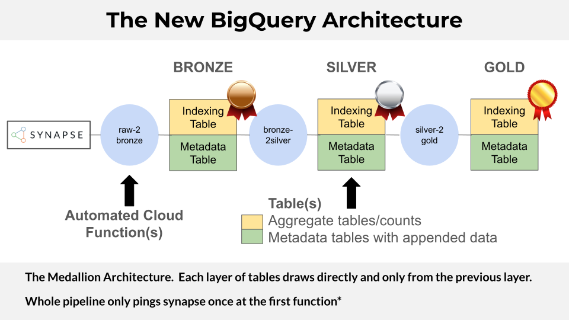

  

# Level Descriptions

### Bronze
- **Source**: Direct submissions from Centers via Synapse.
- **Content**: Unprocessed, minimally validated metadata and file records.
- **Purpose**: Serves as the canonical log of all received submissions, preserving raw inputs for auditability.

### Silver
- **Source**: Outputs from automated validation pipelines (e.g. DCA, Schematic, Google Cloud Functions, etc.)
- **Content**: Cleaned and verified metadata, including:
    - Synapse ID validity
    - HTAN ID formatting
    - Proper file-model mappings
    - Dependency and linkage checks (e.g., participant-biospecimen-file relationships)
    - Flags or error columns for issues
    - Connections to provenance tables
    - Exclusion list filtering
- **Purpose**: Enables accurate batch construction and dataset-level validation.

### Gold
- **Source**: Curated output from Silver level.
- **Content**: Final release tables (metadata and entities).
- **Purpose**: Drives all downstream data dissemination (HTAN Data Portal, CRDC, ISB-CGC)
